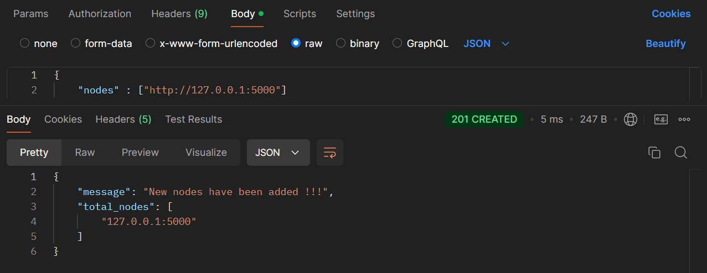

# 🔗 Blockchain Implementation with Python & Flask

This repository features a straightforward yet comprehensive implementation of a blockchain using Python and Flask. The project showcases how blockchain concepts can be brought to life through a web server, enabling users to interact with the blockchain through HTTP server requests.

# 📚 Project Overview

Blockchain technology is a revolutionary concept in digital security and distributed computing. This project serves as an educational and practical guide for understanding the foundational elements of blockchain. By running this Flask-based HTTP server, users can perform actions such as mining new blocks, adding transactions, registering nodes, and resolving chain conflicts to achieve consensus.

# 🛠️ Key Functionalities

• Genesis Block Creation: Automatically generates the first block in the blockchain upon instantiation.  
• Mining New Blocks: Implements a simple proof-of-work algorithm to add blocks to the chain.  
• Transaction Management: Allows the creation of new transactions between nodes.  
• Consensus Mechanism: Includes a conflict resolution algorithm to ensure the blockchain remains authoritative by adopting the longest valid chain.  
• Node Registration: Supports the addition of nodes to create a decentralized network.  
• Chain Inspection: Provides a full-chain display for transparency and verification.  

# 🚀 HTTP Endpoints

The following routes are provided by the Flask server:

• `/mine` [GET]: Mines a new block and adds it to the chain.  
• `/transactions/new` [POST]: Adds a new transaction to the list of pending transactions.  
• `/chain` [GET]: Returns the full blockchain.  
• `/nodes/register` [POST]: Registers new nodes to the network.  
• `/nodes/resolve` [GET]: Initiates the consensus algorithm to resolve conflicts and update the chain.  

# 🧩 Technical Details

• Proof-of-Work: A simple algorithm where the hash of the concatenated proof and previous hash must start with four leading zeros.  
• Hashing: Uses SHA-256 for block hashing to ensure data integrity.  
• Decentralization: Nodes can be registered and communicate over a network to maintain a distributed ledger.  
• Consensus: Ensures that the longest valid chain is adopted across nodes to maintain consistency.  

# 📂 Repository Structure

bash  
Copy code  
├── blockchain.py         # Core blockchain logic   
├── requirements.txt      # Dependencies  
└── README.md             # Project description  

# 🎉 Sample Interactions  

• Mine a Block: Access `http://localhost:5000/mine` to create and add a new block.  
    
• Add Transactions: Send a POST request to `http://localhost:5000/transactions/new` with a JSON payload:  
  Copy code:  
  `{
      "sender": "sender-address",  
      "recipient": "recipient-address",  
      "amount": 1  
  }`  
    
• Display the blockchain: Use `http://localhost:5000/chain` to add new nodes.  
    
   
• Register Nodes: Use `http://localhost:5000/nodes/register` to add new nodes.  
    
• Resolve Conflicts: Visit `http://localhost:5000/nodes/resolve` to execute the consensus algorithm (when multiple blockchains have been created via different ports or devices).  

# 🧑‍💻 Contributions & Feedback

Contributions are welcome! Feel free to submit issues, create pull requests, and share feedback to make this project better. 😊
